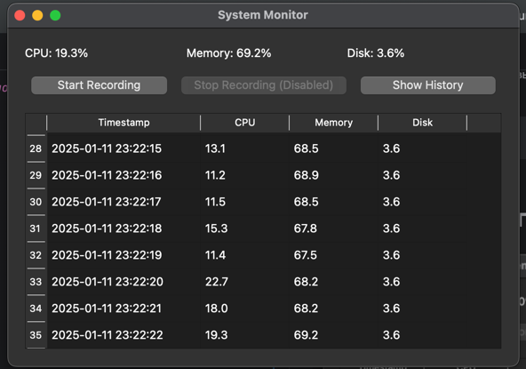

# Инструкция по установке и запуску проекта

Данный документ описывает шаги по установке и запуску проекта.

## Установка

## 1. **Установите Python:**

Убедитесь, что на вашем компьютере установлен Python версии 3.6 или выше. Вы можете скачать последнюю версию с
официального сайта: [https://www.python.org/downloads/](https://www.python.org/downloads/)

## 2. **Склонируйте проект:**

Если на Вашем устройстве установлен Git

   ```Bash
    git clone https://github.com/Timofey121/NPO-Avtomotiv.git
   ```

Если не устанволен Git, то просто скачайте проект и разверните на своем устройстве

## 3. **Создайте виртуальное окружение:**

Рекомендуется использовать виртуальное окружение для изоляции зависимостей проекта. Для создания виртуального
окружения
выполните следующую команду в терминале:

   ```Bash
    python -m venv venv
   ```

## 4. **После создания виртуального окружения необходимо его активировать.**

Linux/macOS:

   ```Bash
   source venv/bin/activate
   ```

Windows:

   ```Bash
   venv\Scripts\activate
   ```

## 5. Установите зависимости:

Все необходимые зависимости проекта перечислены в файле requirements.txt. Для их установки выполните следующую
команду:

   ```Bash
   pip install -r requirements.txt
   ```

# Запуск

После установки всех зависимостей вы можете запустить проект с помощью следующей команды:

```Bash
python main.py
```

# Скриншоты программы




# Скриншот прохождения всех тестов

